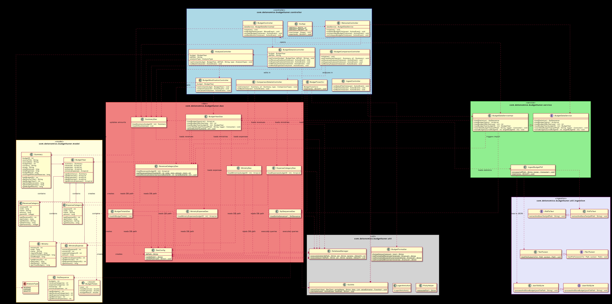
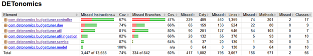

# Prime Minister for a Day - State Budget Analysis Tool


## Project Overview

This project is an application for reviewing, processing, and analyzing the state budget. It allows users to view/change budget data, introduce hypothetical changes, and see the impact of those changes.

## Technical Report

### Compilation Instructions
To compile the project and install dependencies, use Maven:
```bash
mvn clean install
```
ensure you have JDK 21+ installed.

### Configuration
To use the PDF ingestion feature, you need to set up your Google Gemini API key.

**On Windows (Command Prompt):**
```cmd
set GEMINI_API_KEY=your_api_key_here
```

**On Linux/macOS:**
```bash
export GEMINI_API_KEY=your_api_key_here
```

### Execution Instructions
To run the application, you can use the Maven JavaFX plugin or the executable JAR.

**Using Maven (Development):**
```bash
mvn javafx:run
```

**Using Executable JAR:**
After compilation, a JAR file is generated in the `target` directory.
```bash
java -jar target/budgettuner-0.1.0-SNAPSHOT.jar
```

### Usage Instructions
1.  **Main Menu Screen:**
    The welcome screen serves as the central hub, offering three main functions:
    *   **Choose Existing Budget**: Explore data for existing budgets (2019-2026) and any custom budgets created by the user.
    *   **Compare Budgets**: Compare two budgets (original or modified) to visualize differences.
    *   **Import New Budget**: Insert a new budget from a PDF file.

2.  **Exploring & Modifying Budgets:**
    *   **Selection**: Selecting "Choose Existing Budget" opens a list of available budgets. Clicking on one opens the **Budget View**.
    *   **Budget View**: This screen displays the financial overview with charts. It includes buttons for detailed analysis of **Revenues**, **Expenses**, and **Ministries**.
    *   **Modification**: The **"Budget Modification"** button allows you to edit the values of the current budget. You can adjust specific expenses or revenues and save the result as a new custom budget.

3.  **Comparing Budgets:**
    *   The **"Compare Budgets"** screen is designed for comparative analysis.
    *   **Dropdown Selection**: Use the dropdowns to select any two budgets (e.g., an original year vs. a modified scenario).
    *   **Analysis**: The screen displays side-by-side graphs and numerical differences for Totals.
    *   **Deep Dive**: Buttons for **Revenues**, **Expenses**, and **Ministries** allow you to analyze the specific differences between the two selected budgets in detail.

4.  **Importing New Budgets:**
    *   **Select File**: Click **"Import New Budget"** on the main menu. Use the file chooser to select a valid State Budget PDF.
    *   **Process**: Click **Start** to begin the ingestion pipeline. The application will convert the PDF to text, use AI to parse the data into JSON, and finally store it in the database.
    *   **Status**: Follow the progress bar and status messages. Once complete, the new budget will be available for selection in the Exploratory and Comparison screens.

### Repository Structure Presentation
*   **src/main/java/com/detonomics/budgettuner**: Main source code.
    *   **controller**: Logic for JavaFX views (`BudgetComparisonController`, `BudgetModificationController`, etc.).
    *   **dao**: Data Access Objects for SQLite database interactions (`BudgetYearDao`, `MinistryDao`, etc.).
    *   **model**: POJO classes representing budget entities (`Summary`, `Ministry`, `RevenueCategory`).
    *   **service**: Business logic and transaction management (`BudgetDataService`, `BudgetModificationService`).
    *   **util**: Utilities for Database, Ingestion, and UI helpers.
* src/main/resources: Contains the FXML files for the JavaFX views and the immutable SQLite database shipped with the application.
*   **src/test/java**: Unit tests for the application.
*   **data**: Contains the mutable SQLite database that the client can modify and PDF input files.
*   **docs**: DatabaseDocumentation, UML diagrams and Jacoco report.

### UML Diagram regarding code design
The detailed UML Class diagram for the project's design is available in the `docs` folder.


### Overview of Data Structures and Algorithms
*   **Data Structures:**
    *   **Lists & Maps:** Extensive use of `ArrayList` and `HashMap` for managing collections of Ministries, Revenues, and Expenses in memory.
    *   **Trees:** The budget categories (Revenues/Expenses) are implicitly structured as trees (Category -> Sub-category) which are traversed for aggregation.
*   **Algorithms:**
    *   **Recursive Aggregation:** Used to calculate totals for parent categories by summing up valid children nodes.
    *   **Differential Analysis:** Algorithms to compare two budget snapshots and compute absolute and percentage differences for every line item.
    *   **PDF Parsing:** Custom ingestion logic to parse unstructured PDF text into structured database records.

### Additional Technical Documentation
*   **JavaDoc:** comprehensive code documentation can be generated via:
    ```bash
    mvn javadoc:javadoc
    ```
    (Found in `target/site/apidocs/`)
*   **Test Coverage:** Detailed Jacoco reports for test coverage are available after running tests:
    ```bash
    mvn test
    ```
    (Found in `target/site/jacoco/`)
    Main Jacoco report is also available in the `docs` folder as an image.
    
*   **More README files:** Additional folder specific README files are available.

---

### GitHub Workflow
To ensure smooth collaboration, please follow this workflow:

1.  **Branching**: Always pull `main` before starting. Create feature branches (e.g., `feature/login`, `bugfix/css`).
    ```bash
    git checkout main
    git pull
    git checkout -b feature/my-feature
    ```
2.  **Commits**: Make small, frequent commits with clear messages.
3.  **Syncing**: Use `rebase` to stay up to date with `main`.
    ```bash
    git pull --rebase origin main
    ```
4.  **Pull Request**: Open a PR for code review. Merge only after approval and passing tests.

### Quick Start Scripts
- **macOS/Linux**: `./run.sh`
- **Windows**: `run.bat`

(Use `--build` flag to force a rebuild, e.g., `./run.sh --build`)

### CLI Mode
To run the Command Line Interface instead of the GUI:
```bash
mvn exec:java -Dexec.mainClass="com.detonomics.budgettuner.controller.BudgetTunerCLI"
```